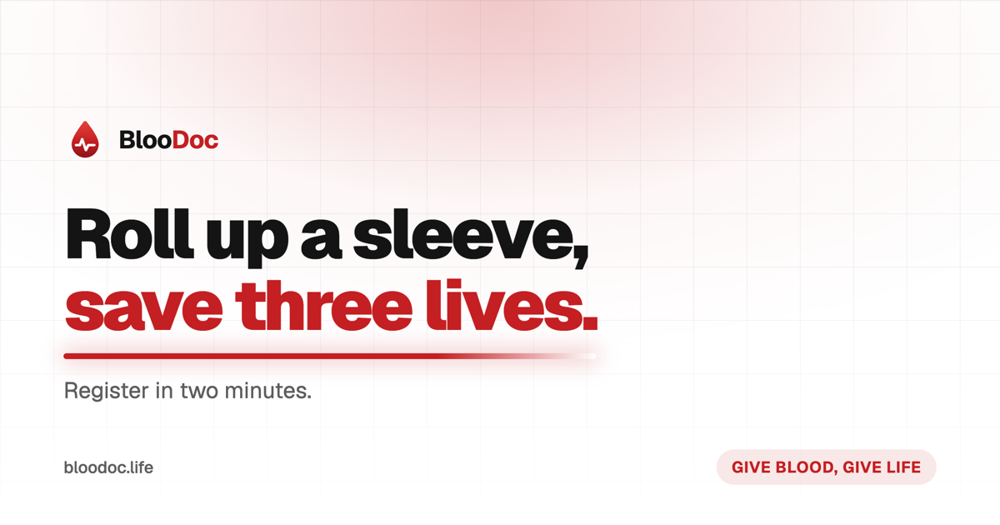

<p align="center">
  
</p>

<h1 align="center">BlooDoc</h1>

<p align="center">
  <strong>Roll up a sleeve, save three lives.</strong><br>
  <sub>Blood donation camps, from the sign-up form to the roster.</sub>
</p>

<p align="center">
  <a href="https://bloodoc.life"></a>
  
  
  
  
  
</p>

<p align="center">
  <a href="https://bloodoc.life">Website</a> ·
  <a href="https://bloodoc.life/camps">Camps</a> ·
  <a href="https://bloodoc.life/eligibility">Can I give?</a> ·
  <a href="https://bloodoc.life/faq">FAQ</a>
</p>

<br>

<p align="center">
  
</p>

---

## What it is

A blood donation camp, run end to end on one record.

A donor fills the form once — on their phone, in about two minutes — and that
row is the same one the desk screens against on the day, the roster is built
from, the reminder is sent to, and the next camp six months later pre-fills.
Nothing is re-keyed, so nothing disagrees, and nobody spends the evening after
a camp typing up paper slips.

The public site is the pitch and the form. The console is where the morning
actually happens.

## The two halves

|                                   |                                     |
| --------------------------------- | ----------------------------------- |
| 🩸 Camp registration, in two minutes | 📋 Live roster with screening status |
| 🧬 Donor record that carries between camps | 🔎 Filter by group, department or status |
| 📧 Confirmation + reminder email, branded | 📊 Counts by group, deferral and first-timer |
| ✅ Eligibility guidance, honestly hedged | ✨ Assistant that reads your own roster |
| 🔑 Sign in with an emailed code, no password | 🗓️ Camps: draft, published, closed |

## How it's built

| Concern         | Approach                                                                                                                                                                  |
| --------------- | ------------------------------------------------------------------------------------------------------------------------------------------------------------------------- |
| **Identity**    | Email OTP only. A six-digit code is minted here, stored as a SHA-256 hash, mailed by ZeptoMail, then exchanged for a real Supabase session via `generateLink` + `verifyOtp`. No password exists anywhere. |
| **Isolation**   | Postgres RLS on every table. A donor's session reads that donor's rows because Postgres refuses the rest — not because the app remembered to filter. `email_otps` has RLS on with *no policies at all*. |
| **The one public write** | Anonymous registration goes through a single Zod-validated Server Action on the service-role client, so the table's write policy stays strict and there is exactly one place an unauthenticated row can be created. |
| **Vitals**      | Weight, blood pressure and medication live on the *registration*, not the donor — a screening record is a snapshot of a day, and storing it on the person means September overwrites March. |
| **Mail**        | ZeptoMail HTTP API, inline-styled table markup. Every attempt is logged, successes included — a log that only records failures cannot answer "did it actually go out". |
| **Assistant**   | Any OpenAI-compatible endpoint, with read-only tools that run on the *caller's* Supabase session. The system prompt shapes tone; RLS is what keeps it inside the right data. |
| **Motion**      | GSAP + ScrollTrigger for anything scroll-linked, Lenis for momentum, CSS for everything else. Reduced motion gets a different layout, not a disabled one. |
| **SEO / AEO / GEO** | One cross-referenced JSON-LD `@graph` (Organization + WebSite + Event), `FAQPage` markup sharing one source with the visible page, `/llms.txt`, a sitemap that lists camps rather than auth screens, and `max-snippet: -1` so answer engines may quote at length. |

**Stack:** Next.js 16 (App Router, Turbopack) · React 19 · TypeScript `strict` ·
Tailwind v4 + shadcn/ui · Supabase (Postgres, Auth, RLS) · ZeptoMail ·
GSAP + Lenis.

## Layout

| Path | What |
| ---- | ---- |
| [`src/app`](src/app) | Routes. Public site, `(auth)`, `(console)/admin`, `/me`, plus `robots.ts`, `sitemap.ts` and `llms.txt` |
| [`src/components/marketing`](src/components/marketing) | The landing: pinned hero, event card, walkthroughs, the registration form |
| [`src/components/admin`](src/components/admin) | Console pieces: camp form, roster row, assistant |
| [`src/lib`](src/lib) | Auth, Supabase clients, email, camps, donors, SEO, AI tools |
| [`supabase/migrations`](supabase/migrations) | Schema. Changes are **files**, never dashboard clicks |
| [`marketing/og`](marketing/og) | Source for `public/og.png` |

## Getting started

```bash
pnpm install
cp .env.example .env.local     # Supabase, ZeptoMail, optional SARVAM_API_KEY
pnpm dev
```

Then, once somebody has signed in at `/signin` at least once:

```bash
node scripts/make-admin.mjs you@example.com    # promote them to the console
node scripts/seed-demo.mjs --yes               # optional: 40 demo donors
```

| Script | Does |
| ------ | ---- |
| `pnpm dev` | Dev server |
| `pnpm build` | Production build |
| `pnpm start` | Serve the production build |
| `pnpm lint` | ESLint |
| `pnpm typecheck` | `tsc --noEmit` |
| `supabase db push` | Apply migrations to the linked project |

> **Set `.env.local` before you build.** `NEXT_PUBLIC_SUPABASE_URL` and
> `NEXT_PUBLIC_SITE_URL` are inlined into the bundle at build time — change them
> afterwards and you have to rebuild.

## Roles

There are two, and `profiles.role` is the only place either is written.

- **donor** — sees their own record at `/me`: their group, their donation
  count, every camp they joined and why they were deferred if they were.
- **admin** — the console at `/admin`.

Role is deliberately **not** in the JWT. A role baked into a token stays valid
until the token expires, so demoting an admin would take up to an hour to bite.
Every policy reads the table instead.

An admin can only be made from a shell (`scripts/make-admin.mjs`). A console
that can mint its own administrators is one compromised session away from a
permanent second one.

## Brand

| Asset | Path |
| ----- | ---- |
| Mark | [`public/brand/logo.svg`](public/brand/logo.svg) — a drop with an ECG trace through it. Also inline in [`src/components/brand.tsx`](src/components/brand.tsx) so it takes `currentColor` |
| Favicon | [`public/icon.svg`](public/icon.svg) |
| Link preview | [`public/og.png`](public/og.png) — source in [`marketing/og/og.html`](marketing/og/og.html), re-render with `node marketing/og/render.mjs`, then bump `?v=` in `src/lib/seo/page-metadata.ts` |

Near-monochrome ground, one crimson accent (`--primary`, oklch `0.52 0.205 22`).
`--destructive` sits at hue 41 rather than the usual red, so a delete button is
not the same colour as a donate button.

Light mode only for now. The dark tokens are still in `globals.css` and are
written properly — to turn it back on, drop `forcedTheme` in
[`src/components/theme-provider.tsx`](src/components/theme-provider.tsx) and put
a three-way Light / Dark / System control back in the header.

## Not built yet

- [ ] **Rate limiting on public registration.** The unique `(camp_id, donor_id)`
      constraint stops duplicates; nothing stops a script submitting a thousand
      distinct people.
- [ ] **Donor self-edit.** Corrections currently go through re-registering or an
      email.
- [ ] **Certificates.** Mentioned in `/llms.txt` as a service; not generated.
- [ ] **A lawyer on the legal pages.** `src/lib/legal/documents.ts` is honest
      about what the software does, which is not the same as being reviewed.
- [ ] **Real-hardware pass.** Pinning plus momentum scroll is exactly the
      combination that misbehaves on iOS and Android.

---

<p align="center">
  <br>
  <sub>Registering is not a medical clearance. Eligibility is decided by the medical officer at the camp.</sub>
</p>
